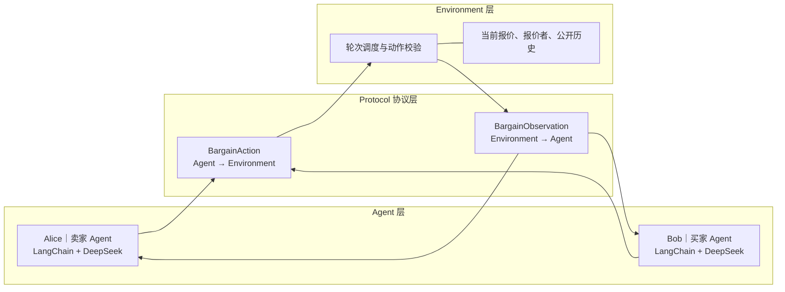
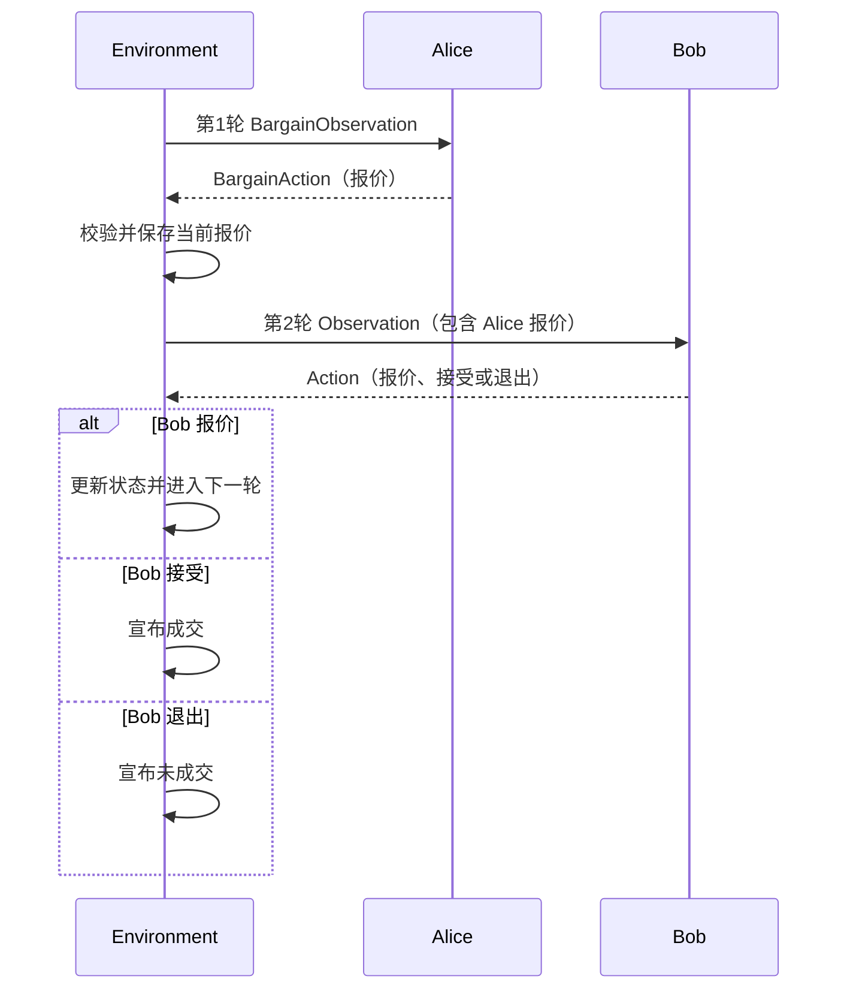

# Agent Economy Sim v1

基于 LangChain 1.x 和大语言模型的最小双 Agent 讨价还价项目。

v1 对应项目的 Step0：一个卖家 Alice 和一个买家 Bob 围绕一件抽象商品轮流
报价。双方可以自主选择报价、接受或退出，是否成交完全由大模型决定；
Environment 只负责轮次、公共状态和动作合法性。

这个版本刻意只保留 Agent、Protocol、Environment 三个核心模块，用于理解
LangChain 多 Agent 项目最基础的通信闭环。

## 学习目标

v1 主要回答以下问题：

- 如何使用 LangChain 1.x 创建一个由大模型驱动的 Agent；
- 如何给买家和卖家设置不同身份与目标；
- 如何用 Pydantic 定义 Agent 与 Environment 的通信格式；
- Environment 如何选择当前行动者并推进轮次；
- 大模型的自然语言决策如何转换成程序可校验的结构化 Action；
- 为什么 Agent 负责主观决策，而 Environment 负责确定性规则。

## 项目结构

```text
.
├── agent.py          # 通用 Agent 类、角色 Prompt 和 DeepSeek 调用
├── protocol.py       # BargainObservation 与 BargainAction
├── environment.py    # 双方轮流行动、状态更新、成交判断和程序入口
├── requirements.txt  # Python 依赖
├── .env.example      # 环境变量示例
└── README.md         # 项目说明
```

v1 没有单独的 `main.py`，创建 Agent 和启动 Environment 的入口位于
`environment.py` 底部的 `main()` 函数。

## 总体架构



Protocol 只定义数据结构，不负责主动传递消息。Environment 创建 Observation、
调用当前 Agent，再接收该 Agent 返回的 Action。

核心调用是：

```python
action = actor.decide(observation)
```

## 三个模块的功能

### 1. `protocol.py`：结构化通信协议

Protocol 使用 Pydantic 定义两个数据模型。

#### `BargainObservation`

由 Environment 发给当前行动的 Agent，包含：

- `round_number`：当前轮数；
- `max_rounds`：最大轮数；
- `current_price`：当前有效报价，没有报价时为空；
- `offered_by`：当前报价者；
- `history`：从第一轮开始积累的公开谈判历史。

#### `BargainAction`

由 Agent 返回给 Environment，包含：

```text
action_type：报价、接受或退出
price：报价时填写的正数，其他动作时为空
message：展示给对方的中文发言
```

Pydantic 校验“报价”必须携带大于零的价格，并把接受或退出动作中的价格清空。

### 2. `agent.py`：大模型决策层

Alice 和 Bob 共用 `BargainingAgent` 类，通过初始化参数获得不同身份和目标：

```text
Alice｜卖家：尽量以较高价格卖出，并自主判断是否接受
Bob｜买家：尽量以较低价格买入，并自主判断是否接受
```

Agent 内部使用：

```python
create_agent(
    model=model,
    tools=[],
    system_prompt=system_prompt,
    response_format=ToolStrategy(BargainAction),
)
```

各部分职责如下：

- `init_chat_model`：通过 OpenAI 兼容接口连接 DeepSeek；
- `system_prompt`：定义身份、目标、动作范围和中文发言要求；
- `tools=[]`：v1 没有外部工具，只使用大模型的决策能力；
- `ToolStrategy(BargainAction)`：要求最终结果符合 Action Schema；
- `decide()`：把 Observation 整理成中文上下文并调用 LangChain Agent；
- `result["structured_response"]`：取得解析后的 `BargainAction` 对象。

这里的 Agent 不是单纯的一段 Prompt，而是身份、目标、大模型、结构化输出和
决策入口的组合。

### 3. `environment.py`：确定性谈判环境

Environment 不使用大模型计算价格，也不替双方判断交易是否划算。它负责：

- 创建 Alice 和 Bob；
- 读取最大轮数；
- 决定当前轮由谁行动；
- 保存当前报价、报价者和公开历史；
- 为当前行动者创建 Observation；
- 接收并校验 BargainAction；
- 更新报价状态；
- 判断成交、退出或达到最大轮数。

卖家先行动，之后双方按轮次交替：

```python
agents = [seller, buyer]
actor = agents[(round_number - 1) % 2]
```

因此 v1 中的“一轮”表示一个 Agent 完成一次行动，而不是买卖双方各行动一次。

## 完整运行流程

### 1. 创建双方 Agent

`main()` 创建 Alice、Bob，并把二者传入 `BargainingEnvironment`。

### 2. Environment 选择当前行动者

第一轮是 Alice，第二轮是 Bob，第三轮重新回到 Alice，以此类推。

### 3. Environment 创建 Observation

例如第二轮 Bob 可能收到：

```text
当前轮数：2/10
当前报价：500
当前报价者：Alice
公开历史：
第 1 轮，Alice 报价 500：这件商品我报价500元。
```

### 4. Agent 调用大模型

`decide()` 将 Observation 转成大模型能够理解的中文消息。大模型根据自己的
角色、目标、剩余轮数和历史，自主选择报价、接受或退出。

### 5. LangChain 返回结构化 Action

例如 Bob 还价：

```python
BargainAction(
    action_type="报价",
    price=420,
    message="500元偏高，我愿意出420元。",
)
```

### 6. Environment 校验并更新状态

Environment 会检查：

- 接受时必须已经存在报价；
- Agent 不能接受自己提出的报价；
- 报价必须包含正数价格。

如果动作是报价，Environment 更新当前价格和报价者，并写入公开历史。

### 7. 结束或继续

- `接受`：双方以当前价格成交；
- `退出`：本次谈判未成交；
- `报价`：进入下一轮；
- 达到最大轮数仍未接受：本次谈判未成交。

最后一轮不会强制大模型成交。

## 通信时序



Agent 之间没有直接方法调用。Alice 的 Action 先由 Environment 写入状态，
Bob 再通过下一轮 Observation 看到 Alice 的公开行动。

## 安装

建议使用 Python 3.12。

```bash
git clone https://github.com/Victor-Zou616/agent_economy_sim.git
cd agent_economy_sim
git checkout v1

python3.12 -m venv .venv
source .venv/bin/activate
pip install -r requirements.txt
cp .env.example .env
```

在 `.env` 中填写：

```dotenv
DEEPSEEK_API_KEY=请填写你的密钥
DEEPSEEK_MODEL=deepseek-v4-pro
```

`.env` 包含密钥，不应提交到 GitHub。

## 运行

```bash
python environment.py --rounds 10
```

参数说明：

| 参数 | 默认值 | 作用 |
|---|---:|---|
| `--rounds` | `10` | 设置双方最多进行多少次行动 |

## 当前版本边界

- 只有一个卖家和一个买家；
- 谈判商品是抽象商品，不能通过命令行指定具体商品；
- 没有库存、预算、心理估值或真实资金结算；
- 没有 Tool Calling，`create_agent` 的工具列表为空；
- 所有谈判信息公开，没有 Agent 私有信息；
- 历史记录会完整加入后续 Observation，没有上下文压缩；
- Environment 不限制卖家与买家报价的变化方向；
- 大模型生成的价格是主观结果，不代表真实市场价格；
- Agent 没有持久化长期记忆，程序结束后状态消失。

这些限制是有意保留的。v1 的目标是用最少代码展示下面这个闭环：

```text
Environment 创建 Observation
    → Agent 调用大模型
    → 返回结构化 Action
    → Environment 校验并更新状态
    → 下一轮
```

## 下一版本

v2 在不改变核心通信方式的基础上升级为一个卖家和两个买家的商品竞价，并将
程序入口单独拆分为 `main.py`。
