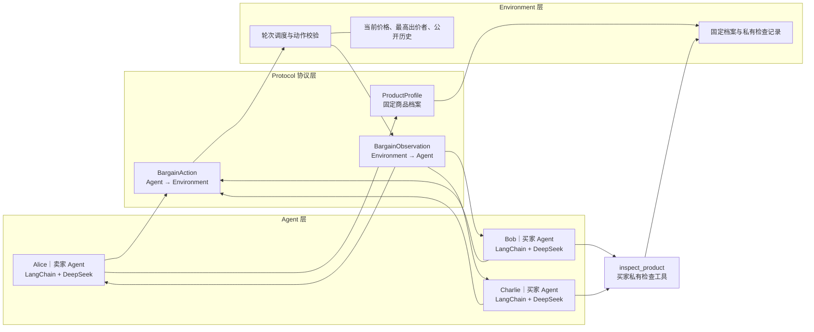
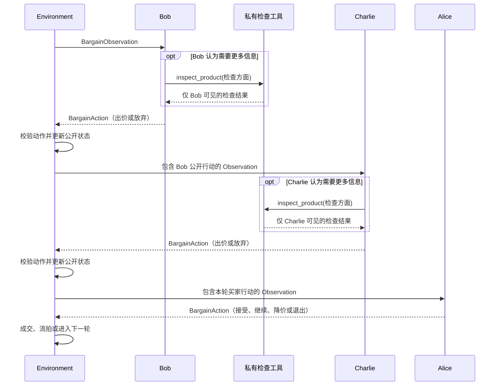

# Agent Economy Sim v3

基于 LangChain 1.x 和大语言模型的最小三 Agent 商品竞价项目。

系统包含一个卖家 Alice、两个买家 Bob 与 Charlie。卖家负责建立商品档案、
自主挂牌和决定是否成交；买家可以根据公开历史自主出价或放弃，也可以调用
私有商品检查工具补充信息。Environment 不参与主观定价，只负责轮次推进、
状态维护、动作校验和成交判断。

v3 的学习重点是：在保持代码结构简单的前提下，理解 LangChain Agent、
结构化通信协议、确定性 Environment 和 Tool Calling 如何组合成一个完整系统。

## 为什么使用 Agent

交易结果不应由一个大模型直接生成，而应由多个具有不同身份、目标和信息的
参与者通过持续互动逐步形成。

本项目将职责分成两部分：

- Agent 负责主观判断、工具选择、报价策略和自然语言发言。
- Environment 负责客观规则、状态校验、信息隔离和最终结算。

这样既保留了大模型决策的灵活性，也避免让大模型随意修改竞价规则。

## 版本演进

```text
v1：两个 Agent 进行最小讨价还价
v2：升级为一个卖家和两个买家的连续竞价
v3：增加 LangChain Tool Calling、固定商品档案和买家私有信息
```

## 项目结构

```text
.
├── main.py          # 命令行入口，创建并组装所有对象
├── agent.py         # Agent、角色 Prompt、DeepSeek 和 LangChain 调用
├── protocol.py      # ProductProfile、BargainObservation、BargainAction
├── environment.py   # 竞价状态、轮次、规则校验和成交判断
├── tools.py         # 买家私有商品检查工具及检查记录
├── requirements.txt # Python 依赖
├── .env.example     # 环境变量示例
└── README.md        # 项目说明
```

## 总体架构



Protocol 是数据格式定义，不是消息服务器。Agent 之间不会直接调用对方，
所有公开互动都由 Environment 转换成下一位 Agent 的 Observation。

## 五个模块的功能

### 1. `main.py`：启动与依赖组装

`main.py` 是项目入口，不包含竞价规则。它负责：

1. 读取 `--product`、`--rounds` 和 `--inspections` 参数；
2. 创建共享的 `ProductInspectionService`；
3. 创建 Alice、Bob 和 Charlie 三个 Agent；
4. 给两个买家分别绑定私有检查工具；
5. 创建 `BargainingEnvironment` 并调用 `run()`。

角色目标也在这里注入：Alice 自主挂牌并判断是否接受报价，Bob 和 Charlie
在竞争中尽量以较低价格竞得商品。

### 2. `protocol.py`：结构化通信协议

该模块使用 Pydantic 定义三个数据模型。

#### `ProductProfile`

保存商品的固定模拟档案：

- 商品名称；
- 整体状况；
- 使用历史；
- 维护或保存情况；
- 缺陷与风险；
- 来源与真实性。

档案在开拍前生成一次，竞价过程中不能修改。

#### `BargainObservation`

由 Environment 发给当前 Agent，包含：

- 当前商品和竞价阶段；
- 当前轮数和最大轮数；
- 当前有效价格和最高出价者；
- 当前 Agent 的允许动作；
- 从挂牌开始积累的公开历史；
- 仅当前 Agent 可见的私有信息。

#### `BargainAction`

由 Agent 返回给 Environment，包含：

```text
action_type：挂牌、出价、放弃、接受、继续、降价或退出
price：挂牌、出价、降价时填写的正数
message：显示给其他参与者的中文发言
```

Pydantic 负责基础格式校验，Environment 再根据当前阶段执行规则校验。

### 3. `agent.py`：大模型决策层

三个参与者共用 `BargainingAgent` 类，通过姓名、角色、目标和工具列表形成
不同实例。

每个 Agent 内部包含：

- 身份与目标；
- 买家或卖家的角色规则；
- DeepSeek 聊天模型；
- LangChain `create_agent`；
- 可选工具；
- `decide(observation)` 决策入口。

Agent 使用以下组合：

```python
create_agent(
    model=model,
    tools=tools,
    system_prompt=system_prompt,
    response_format=ToolStrategy(BargainAction),
)
```

`decide()` 会把结构化 Observation 整理成大模型可以理解的中文上下文。
买家可以先调用工具，也可以直接决策。最终结果由 LangChain 解析为
`BargainAction`，再交还 Environment。

卖家还通过 `with_structured_output(ProductProfile)` 在开拍前生成一次商品档案。
该步骤只生成商品事实，不生成市场价格；挂牌价格仍由卖家 Agent 在挂牌阶段
根据商品名称、私有档案、目标和模型内部知识自主决定。

### 4. `tools.py`：私有商品检查工具

`ProductInspectionService` 保存固定商品档案，并为 Bob、Charlie 分别创建
绑定身份的 `inspect_product` 工具。

买家可以检查：

- 整体状况；
- 使用历史；
- 维护或保存情况；
- 缺陷与风险；
- 来源与真实性。

工具具有以下规则：

- 每个买家的检查次数分别计算；
- 上限由 `--inspections` 配置；
- 重复查询同一方面不会消耗新的检查次数；
- 结果默认只对调用工具的买家可见；
- 结果会进入该买家后续轮次的私有 Observation；
- 买家可以在公开发言中主动披露检查结果。

这是一次真实的 LangChain Tool Calling：大模型自主决定是否调用工具、选择
检查方面并读取返回值，然后继续生成最终 Action。但工具的数据源是本地固定的
模拟档案，不是互联网或真实鉴定数据库。

### 5. `environment.py`：确定性竞价环境

Environment 是系统的流程控制器，不调用大模型作主观判断。它负责：

- 保存商品、轮数、当前价格、最高出价者和公开历史；
- 选择当前应该行动的 Agent；
- 根据身份创建公开信息和私有信息不同的 Observation；
- 调用 `actor.decide(observation)`；
- 校验 Action 是否属于当前允许动作；
- 校验出价必须严格高于当前有效价格；
- 校验降价只能发生在没有买家出价时，且新价格必须更低；
- 更新竞价状态并将公开发言写入历史；
- 根据卖家动作判断成交、继续或流拍；
- 在无报价和有报价的情况下输出准确的结束原因。

Environment 只判断“动作是否合法”，不会判断某个价格是否符合真实市场行情。

## 完整运行流程

### 阶段一：建立固定商品档案

```text
Environment 请求 Alice 建立 ProductProfile
    ↓
Alice 使用 DeepSeek 生成结构化模拟档案
    ↓
Environment 与 ProductInspectionService 固定保存档案
    ↓
竞价过程中不允许修改
```

完整档案是 Alice 的私有信息。Bob 和 Charlie 只能通过工具检查其中有限的方面。

### 阶段二：卖家挂牌

Environment 向 Alice 发送挂牌 Observation，允许动作是“挂牌”或“退出”。
Alice 根据商品名称、完整档案、卖家目标和大模型内部知识，自主返回：

```python
BargainAction(
    action_type="挂牌",
    price=650,
    message="自用通勤车，功能基本正常，挂牌价650元。",
)
```

Environment 校验价格为正数后保存挂牌状态。

### 阶段三：买家依次决策

每轮按照固定顺序运行：

```text
Bob → Charlie → Alice
```

Bob 收到当前 Observation 后，可以直接“出价”或“放弃”，也可以先调用检查
工具。Bob 的公开动作被 Environment 写入历史后，Charlie 才收到自己的
Observation，因此 Charlie 能看到 Bob 本轮的公开行动，但看不到 Bob 的私有
工具结果。

买家的有效出价必须严格高于当前价格。“放弃”只表示本轮不加价，不会撤回
此前仍然有效的最高报价。

### 阶段四：卖家决策

两个买家完成行动后，Alice 根据当前状态决策。

没有买家出价时：

```text
降价 / 继续 / 退出
```

已经存在买家报价时：

```text
接受 / 继续 / 退出
```

- 接受：当前最高出价者立即成交；
- 继续：保留现有状态并进入下一轮；
- 降价：没有买家出价时降低挂牌价；
- 退出：终止竞价并宣布未成交。

### 阶段五：进入下一轮或结束

```text
卖家继续
    ↓
Environment 增加轮数
    ↓
重新生成 Bob 的 Observation
    ↓
Bob → Charlie → Alice
```

达到最大轮数时，卖家必须接受现有报价或退出；如果始终没有买家报价，则直接
退出并流拍。是否成交由卖家 Agent 决定，Environment 不会为了得到成交结果而
强制接受。

## 一轮竞价的通信时序



## 信息可见范围

| 信息 | Alice | Bob | Charlie |
|---|---:|---:|---:|
| 商品名称、轮数、当前价格 | 可见 | 可见 | 可见 |
| 最高出价者和公开历史 | 可见 | 可见 | 可见 |
| 完整固定商品档案 | 可见 | 不可见 | 不可见 |
| Bob 的私有检查结果 | 不可直接见 | 可见 | 不可见 |
| Charlie 的私有检查结果 | 不可直接见 | 不可见 | 可见 |
| 其他 Agent 的内部推理 | 不可见 | 不可见 | 不可见 |

私有工具结果不会自动公开。如果买家主动在 `message` 中引用检查结果，这段发言
会进入公开历史，之后其他 Agent 可以看到。

## 安装

建议使用 Python 3.12。

```bash
git clone https://github.com/Victor-Zou616/agent_economy_sim.git
cd agent_economy_sim
git checkout v3

python3.12 -m venv .venv
source .venv/bin/activate
pip install -r requirements.txt
```

复制环境变量示例：

```bash
cp .env.example .env
```

在 `.env` 中填写 DeepSeek 配置：

```dotenv
DEEPSEEK_API_KEY=请填写你的密钥
DEEPSEEK_BASE_URL=https://api.deepseek.com
DEEPSEEK_MODEL=deepseek-v4-pro
```

`.env` 包含密钥，不应提交到 GitHub。

## 运行

```bash
python main.py --rounds 5 --product "二手自行车" --inspections 2
```

参数说明：

| 参数 | 默认值 | 作用 |
|---|---|---|
| `--product` | `二手自行车` | 指定本次竞价商品 |
| `--rounds` | `5` | 指定最大竞价轮数 |
| `--inspections` | `2` | 每位买家最多检查的不同商品方面数量 |

另一个示例：

```bash
python main.py \
  --rounds 10 \
  --product "开了五年的劳斯莱斯幻影" \
  --inspections 2
```

## LangChain 在项目中的作用

当前项目没有使用 LangGraph。LangChain 主要负责：

1. 使用 `init_chat_model` 连接 DeepSeek；
2. 使用 `create_agent` 组合模型、Prompt、工具和结构化输出；
3. 让买家在一次决策过程中自主调用 `inspect_product`；
4. 使用 `ToolStrategy(BargainAction)` 约束最终动作格式；
5. 使用 `with_structured_output(ProductProfile)` 生成固定商品档案。

Agent 的工具调用和主观决策由大模型完成；轮次、动作权限与价格合法性仍由
普通 Python 程序控制。

## 当前版本边界

- 商品档案是仿真开始时由大模型生成的模拟事实，不是现实商品鉴定结果；
- 检查工具读取固定模拟档案，不会查询互联网、市场行情或第三方数据库；
- 卖家挂牌价来自大模型主观判断，不代表真实市场价格；
- Bob 和 Charlie 当前使用相同目标和模型，行为可能比较相似；
- 公开历史会完整放入后续 Observation，当前没有上下文压缩或长期记忆；
- Agent 之间没有点对点通信，所有互动都经过 Environment；
- 项目只模拟单件商品的一次竞价，不处理真实资金、库存和法律结算。

这些限制是有意保留的：v3 的目标不是构建真实交易平台，而是用尽可能少的
模块展示一个可运行、可解释、可继续扩展的 LangChain 多 Agent 项目。

## 后续可扩展方向

- 为不同买家加入预算、偏好和风险承受能力；
- 增加真实市场成交记录查询工具；
- 将卖家挂牌价与买家最高报价拆分为独立状态；
- 增加上下文压缩和每个 Agent 的独立长期记忆；
- 记录结构化实验数据并比较多次仿真结果；
- 增加自动化测试、日志和可视化界面。
