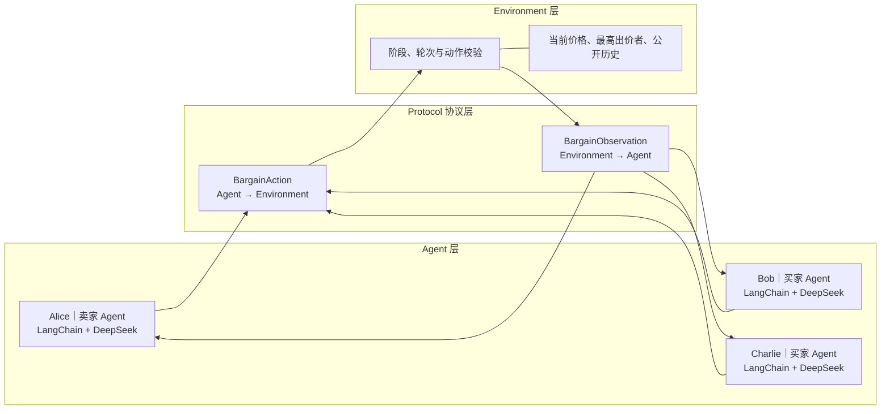
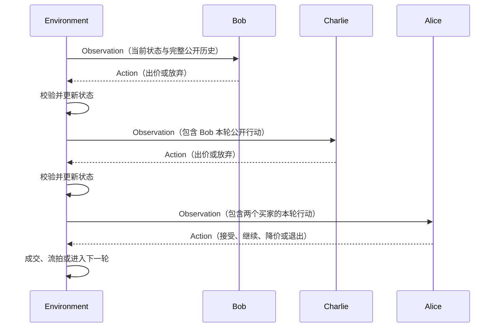

# Agent Economy Sim v2

基于 LangChain 1.x 和大语言模型的最小三 Agent 商品竞价项目。

v2 对应项目的 Step1：系统从 v1 的一个卖家、一个买家讨价还价，升级为一个
卖家 Alice 和两个买家 Bob、Charlie 的连续竞价。卖家自主决定挂牌价格，两个
买家依次出价或放弃，最后由卖家决定接受、继续、降价或退出。

Environment 不替 Agent 计算商品价值，也不会强迫交易成交。它只负责轮次、
状态、动作权限、价格校验和成交判断。

## v2 的主要升级

```text
v1：Alice 与 Bob 轮流讨价还价
                    ↓
v2：Alice 挂牌 → Bob 竞价 → Charlie 竞价 → Alice 决策
```

相较 v1，v2 增加了：

- 第二个买家 Charlie；
- 明确的挂牌、竞价和卖家决策三个阶段；
- 卖家自主选择挂牌价格；
- 买家之间的公开价格竞争；
- 无人出价时的卖家降价机制；
- 买家“本轮放弃但不撤回旧报价”的规则；
- 动作无效时向同一 Agent 反馈原因并重试一次；
- 独立的 `main.py` 程序入口；
- 可通过命令行指定商品和最大竞价轮数。

## 项目结构

```text
.
├── main.py          # 命令行入口，创建并组装三个 Agent 与 Environment
├── agent.py         # 通用 Agent 类、角色 Prompt 和 DeepSeek 调用
├── protocol.py      # BargainObservation 与 BargainAction
├── environment.py   # 三 Agent 竞价流程、公共状态、校验和成交判断
├── requirements.txt # Python 依赖
├── .env.example     # 环境变量示例
└── README.md        # 项目说明
```

## 总体架构



Agent 之间不会直接调用对方。Environment 把前一位 Agent 的公开 Action 写入
历史，再通过下一份 Observation 交给下一位 Agent。

## 四个模块的功能

### 1. `main.py`：启动与依赖组装

`main.py` 只负责组装对象，不负责大模型决策或竞价规则：

1. 读取 `--rounds` 和 `--product`；
2. 创建 Alice 卖家 Agent；
3. 创建 Bob、Charlie 两个买家 Agent；
4. 将三个 Agent、商品名称和轮数传入 Environment；
5. 调用 `environment.run()` 启动竞价。

三个 Agent 共用同一个 `BargainingAgent` 类，但通过角色与目标区分：

```text
Alice｜卖家：自主确定挂牌价格，并判断是否接受当前最高报价
Bob｜买家：在竞争中尽量以较低价格竞得商品
Charlie｜买家：在竞争中尽量以较低价格竞得商品
```

### 2. `protocol.py`：结构化通信协议

Protocol 使用 Pydantic 定义两个通信对象。

#### `BargainObservation`

由 Environment 发给当前 Agent，包含：

- 商品名称；
- 当前阶段：挂牌、竞价或卖家决策；
- 当前轮数和最大轮数；
- 当前有效价格；
- 当前最高出价者；
- 当前 Agent 允许执行的动作；
- 从挂牌开始积累的公开竞价历史。

#### `BargainAction`

由 Agent 返回给 Environment，包含：

```text
action_type：挂牌、出价、放弃、接受、继续、降价或退出
price：挂牌、出价或降价时填写的正数
message：展示给其他参与者的中文发言
```

Pydantic 负责基础格式校验，Environment 再根据阶段和市场状态判断动作是否
合法。

### 3. `agent.py`：大模型决策层

每个 `BargainingAgent` 包含：

- 姓名和角色；
- 角色目标；
- 买家或卖家的 System Prompt；
- DeepSeek 聊天模型；
- LangChain `create_agent`；
- `decide(observation)` 决策入口。

Agent 使用：

```python
create_agent(
    model=model,
    tools=[],
    system_prompt=system_prompt,
    response_format=ToolStrategy(BargainAction),
)
```

v2 还没有 Tool Calling，`tools=[]`。LangChain 在这里主要负责连接模型、组织
Prompt 和约束最终的结构化 Action。

`decide()` 会把 Observation 整理成中文上下文：

```text
当前商品
当前阶段
当前轮数
当前最高价
当前最高出价者
允许动作
公开竞价历史
```

随后调用 `self._agent.invoke()`。最终通过
`result["structured_response"]` 取得已经解析为 Pydantic 对象的
`BargainAction`。

### 4. `environment.py`：确定性竞价环境

Environment 是流程控制器，不调用大模型进行主观定价。它负责：

- 保存商品、最大轮数、当前价格、最高出价者和公开历史；
- 先让卖家完成挂牌；
- 每轮依次让 Bob、Charlie 行动；
- 为当前阶段设置允许动作；
- 校验买家出价必须严格高于当前有效价格；
- 校验卖家只能在无人出价时降价；
- 将每次公开 Action 写入历史；
- 让 Alice 决定成交、继续或退出；
- 达到最大轮数时结束竞价。

动作无效时，Environment 会把原因加入 Observation 的历史，并请求同一个 Agent
重新决策一次。例如：

```text
环境校验反馈：上一次动作无效，出价必须严格高于当前最高价。
```

如果第二次仍然非法，程序抛出异常，避免 Environment 接受错误状态。

## 完整运行流程

### 阶段一：创建系统

```text
main.py 读取参数
    ↓
创建 Alice、Bob、Charlie
    ↓
创建 BargainingEnvironment
    ↓
调用 run()
```

### 阶段二：卖家挂牌

Environment 给 Alice 发送挂牌 Observation，允许动作只有：

```text
挂牌 / 退出
```

Alice 根据商品名称、卖家目标和大模型内部知识自主决定挂牌价格。例如：

```python
BargainAction(
    action_type="挂牌",
    price=650,
    message="二手自行车，挂牌价650元，欢迎出价。",
)
```

Environment 不判断650元是否符合真实市场价格，只校验动作和价格格式。

### 阶段三：Bob 行动

Bob 收到当前价格、公开历史和允许动作：

```text
出价 / 放弃
```

如果出价，新价格必须严格高于当前有效价格；如果放弃，只表示本轮不加价，
下一轮仍可重新参与。

### 阶段四：Charlie 行动

Bob 的公开 Action 被写入历史后，Environment 才为 Charlie 创建 Observation。
因此 Charlie 能看到 Bob 本轮的公开出价或放弃，并在更新后的价格基础上决策。

### 阶段五：Alice 决策

两个买家都行动后，Environment 根据市场状态设置 Alice 的允许动作。

没有买家出价时：

```text
降价 / 继续 / 退出
```

已经存在买家报价时：

```text
接受 / 继续 / 退出
```

- 接受：与当前最高出价者立即成交；
- 继续：保留当前状态并进入下一轮；
- 降价：无人出价时降低挂牌价；
- 退出：本次竞价未成交。

买家本轮选择放弃不会撤回其过去仍然有效的最高报价。只要没有其他买家提出
更高报价，Alice 之后仍可接受该报价。

### 阶段六：下一轮或结束

如果 Alice 选择继续，Environment 增加轮数，再次依次调用 Bob、Charlie、
Alice。最后一轮：

- 有买家报价时，Alice 只能接受或退出；
- 没有买家报价时，Alice 只能退出；
- Environment 不会强制 Alice 成交。

## 一轮竞价的通信时序



## 信息流与历史记录

v2 没有私有商品档案和工具结果，Agent 看到的谈判状态都是公开信息：

| 信息 | Alice | Bob | Charlie |
|---|---:|---:|---:|
| 商品名称和轮数 | 可见 | 可见 | 可见 |
| 当前价格和最高出价者 | 可见 | 可见 | 可见 |
| 公开竞价历史 | 可见 | 可见 | 可见 |
| 其他 Agent 的内部推理 | 不可见 | 不可见 | 不可见 |

公开历史会完整复制到后续 Observation。Bob 在某轮开始时看到此前所有已完成
行动；Charlie 还会看到 Bob 本轮刚完成的行动；Alice 会看到两个买家本轮的
全部公开行动。

## 安装

建议使用 Python 3.12。

```bash
git clone https://github.com/Victor-Zou616/agent_economy_sim.git
cd agent_economy_sim
git checkout v2

python3.12 -m venv .venv
source .venv/bin/activate
pip install -r requirements.txt
cp .env.example .env
```

在 `.env` 中填写 DeepSeek 配置：

```dotenv
DEEPSEEK_API_KEY=请填写你的密钥
DEEPSEEK_BASE_URL=https://api.deepseek.com
DEEPSEEK_MODEL=deepseek-v4-pro
```

`.env` 包含密钥，不应提交到 GitHub。

## 运行

```bash
python main.py --rounds 5 --product "二手自行车"
```

参数说明：

| 参数 | 默认值 | 作用 |
|---|---|---|
| `--rounds` | `5` | 设置最大竞价轮数 |
| `--product` | `二手自行车` | 指定本次竞价商品 |

另一个示例：

```bash
python main.py --rounds 10 --product "开了五年的劳斯莱斯幻影"
```

## LangChain 在 v2 中的作用

当前版本没有使用 LangGraph，也没有调用工具。LangChain 负责：

1. 使用 `init_chat_model` 连接 DeepSeek；
2. 使用 `create_agent` 组合模型、角色 Prompt 和结构化输出；
3. 使用 `ToolStrategy(BargainAction)` 约束最终动作；
4. 把模型输出解析成 Environment 可以校验的 Pydantic 对象。

大模型负责主观判断和自然语言策略，普通 Python Environment 负责确定性的市场
流程和规则。

## 当前版本边界

- 只有一个卖家和两个买家；
- 没有 Tool Calling，三个 Agent 的工具列表都为空；
- 没有固定的客观商品档案，商品属性主要来自卖家的公开描述；
- 所有状态都是公开信息，没有买家私有检查结果；
- Bob 和 Charlie 使用相同目标与模型，行为可能比较相似；
- 卖家定价来自大模型主观判断，不代表真实市场价格；
- 当前价格字段同时承担挂牌价和最高报价两种含义；
- 历史会完整传给后续 Agent，没有上下文压缩或长期记忆；
- 没有预算、库存、真实资金或商品交付；
- Agent 之间没有点对点通信，全部互动由 Environment 中介。

这些限制是有意保留的。v2 的重点是展示如何在不引入 LangGraph 的情况下，
使用同一套 Agent、Protocol、Environment 结构从双人谈判扩展到三人竞价。

## 下一版本

v3 在 v2 的四模块结构上增加私有商品档案和 LangChain Tool Calling。买家可以
自主调用商品检查工具，并且 Bob 与 Charlie 的工具结果相互隔离。
